== Работа в IAR Embedded Workbench

=== Работа с Hse

Задание:

Настроить внешний источник частоты HSE и подключить его на системную шину;

Прошить программу морганиями светодиодом - проверить, что они моргают.

Код и запуск программы представлен на рисунке:

.Установка Hse
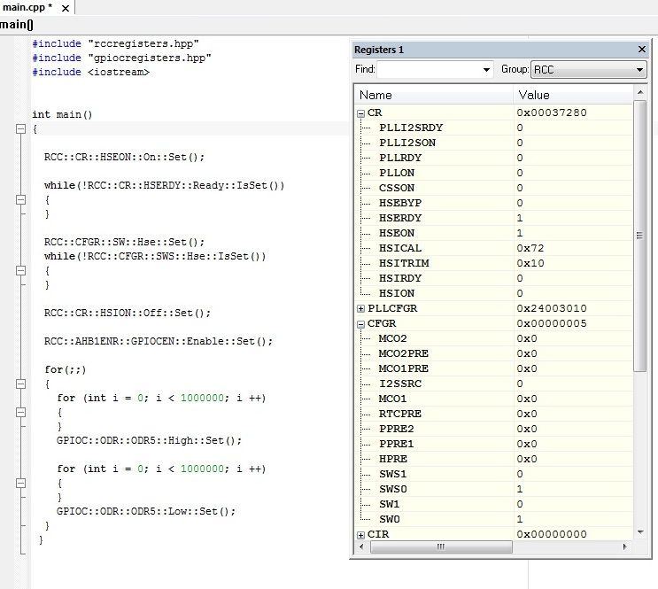

После запуска программы можем заметить, что светодиод на плате начал мограть.
Частота внешнего высокочастотного генератора частоты (HSE) равна 8 МГц.

=== Работа с Hsi

Задание:

Настроить внутренний источник частоты HSI и подключить его на системную шину;

Прошить программу морганиями светодиодом - проверить, что они моргают быстрее в 2 раза

.Установка Hsi
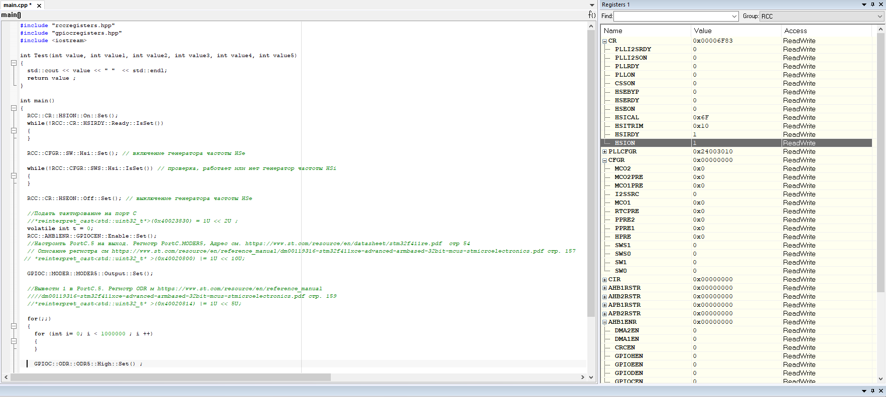

После запуска программы можем заметить, что светодиод на плате начал мограть в два раза быстрее,
чем в первом случае.
Частота внутреннего высокочастотного RC-генератора (HSI) равна 16 МГц

=== Работа с Pll

Задание:

Настроить PLL источник тактовой частоты на 32 Мгц и подключить его на системную шину.

Прошить программу морганиями светодиодом - проверить, что они моргают  еще в 2 раза
быстрее чем в пункте 2.

.Установка Pll
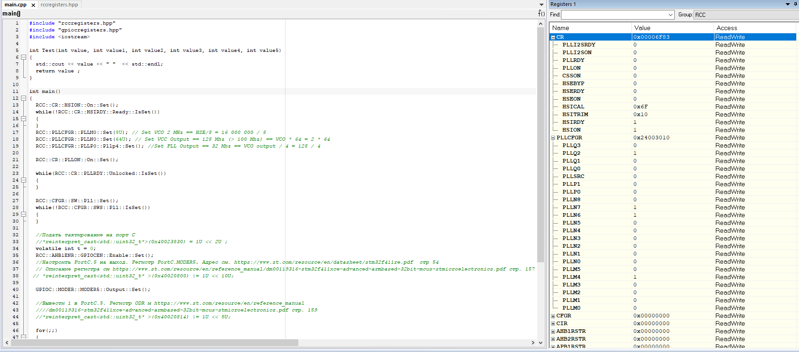

Основной задачей в этом пункте была правильная настройка частоты ФАПЧ.
Сначала использовали источник HSI (16 МГц), от него пошли по следующей:

.Схема использования Pll
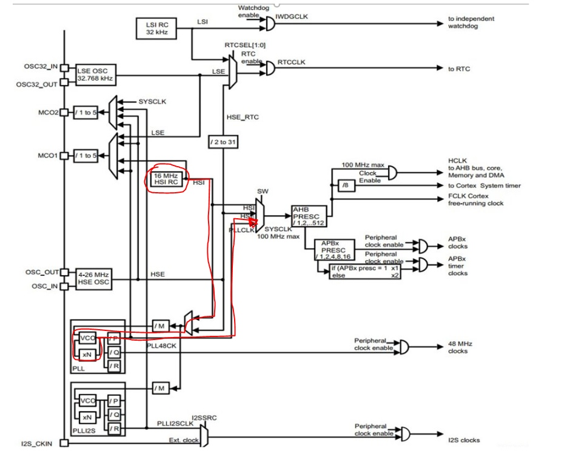

После верной настройки частоты, заметили, что светодиод стал моргать ещё быстрей, чем в пункте 2.
Частота с использованием ФАПЧ (PLL) равна 32 МГц.

=== Ответы на вопросы

*1) Что такое POD типы данных?*

_POD типы в языке C++ это аббревиатура от “PlainOldData”, что можно трактовать как «Простые данные в стиле C».
Все типы делятся на две группы: объектные типы и все остальные. К не объектным типам относятся функции, ссылки и тип void. У таких типов, нельзя узнать размер с помощью операции sizeof.
Группа объектных типов содержит две подгруппы – POD и не-POD типы._

К POD-типам относятся:

- все встроенные арифметические типы;

- перечисления, т.е. типы, объявленные с помощью ключевого слова enum;

- указатели;
- POD-структуры (struct или class) и POD-объединения (union);

Чтобы структура была POD-типом, она должна удовлетворять следующим требованиям:

- не иметь пользовательских конструкторов, деструктора или копирующего оператора присваивания;
- не иметь базовых классов;
- не иметь виртуальных функций;
- не иметь защищенных (protected) или закрытых (private) нестатических членов данных;
- не иметь не статических членов данных не-POD-типов (или массивов из таких типов), а также ссылок.

*2) Назовите все виды типов в языке С++.*

*bool*: логический тип. Может принимать одно из двух значений: _true_ (истина) и
_false_ (ложь). Размер занимаемой памяти для этого типа точно не определен.

*char*: представляет один символ в кодировке ASCII. Занимает в памяти 1 байт (8 бит).
Может хранить любое значение из диапазона от -128 до 127, либо от 0 до 255;

*signed char*: представляет один символ. Занимает в памяти 1 байт (8 бит).
Может хранить любое значение из диапазона от -128 до 127;

*unsigned char*: представляет один символ. Занимает в памяти 1 байт (8 бит).
Может хранить любое значение из диапазона от 0 до 255;

*wchar_t*: представляет расширенный символ. На Windows занимает в памяти
2 байта (16 бит), на Linux - 4 байта (32 бита). Может
хранить любое значение из диапазона от 0 до 65 535 (при 2 байтах),
либо от 0 до 4 294 967 295 (для 4 байт);

*char16_t*: представляет один символ в кодировке Unicode. Занимает в памяти
2 байта (16 бит). Может хранить любой значение из диапазона от 0 до 65 535;

*char32_t*: представляет один символ в кодировке Unicode.
Занимает в памяти 4 байта (32 бита). Может хранить любое
значение из диапазона от 0 до 4 294 967 295;

*short*: представляет целое число в диапазоне от –32768 до 32767.
Занимает в памяти 2 байта (16 бит).Данный тип также имеет синонимы
_shortint_, _signedshortint_, _signedshort_.

*unsigned short*: представляет целое число в диапазоне от 0 до 65535.
Занимает в памяти 2 байта (16 бит). Данный тип также имеет синоним _unsigned short int_.

*int*: представляет целое число. В зависимости от архитектуры
процессора может занимать 2 байта (16 бит) или 4 байта (32 бита).
Диапазон предельных значений соответственно также может варьироваться от
–32768 до 32767 (при 2 байтах) или от −2 147 483 648 до 2 147 483 647 (при 4 байтах).
Но в любом случае размер должен быть больше или равен размеру типа _short_ и меньше
или равен размеру типа _long_. Данный тип имеет синонимы _signed int_ и _signed_.

*unsigned int*: представляет положительное целое число.
В зависимости от архитектуры процессора может занимать
2 байта (16 бит) или 4 байта (32 бита),
и из-за этого диапазон предельных значений может меняться:
от 0 до 65535 (для 2 байт), либо от 0 до 4 294 967 295 (для 4 байт).
В качестве синонима этого типа может использоваться _unsigned_;

*long*: представляет целое число в диапазоне от −2 147 483 648 до 2 147 483 647.
Занимает в памяти 4 байта (32 бита).
У данного типа также есть синонимы _long int, signed long int и signed long_;

*unsigned long*: представляет целое число в диапазоне от 0 до 4 294 967 295.
Занимает в памяти 4 байта (32 бита).Имеет синоним _unsigned long int_;

*long long*: представляет целое число в диапазоне от −9 223 372 036 854 775 808 до
+9 223 372 036 854 775 807. Занимает в памяти, как правило, 8 байт (64 бита).
Имеет синонимы _long long int, signed long long int и signed long long_;

*unsigned long long*: представляет целое число в диапазоне
от 0 до 18 446 744 073 709 551 615. Занимает в памяти, как правило,
8 байт (64 бита).Имеет синоним _unsigned long long int_;

*float*: представляет вещественное число ординарной точности
с плавающей точкой в диапазоне +/- 3.4E-38 до 3.4E+38.
В памяти занимает 4 байта (32 бита);

*double*: представляет вещественное число двойной
точности с плавающей точкой в диапазоне +/- 1.7E-308 до 1.7E+308.
 В памяти занимает 8 байт (64 бита);

*long double*: представляет вещественное число двойной
точности с плавающей точкой не менее 8 байт (64 бит).
В зависимости от размера занимаемой памяти может отличаться диапазон допустимых значений.

*void*: тип без значения.

*3) Что такое пользовательский тип?*

Это тип данных, который определяется самим пользователем.
Это может быть класс, структура, перечисление,
объединение.  Кроме того, с помощью ключевого
слово _typedef_ можно создать пользовательские типы
данных  представляющих собой псевдонимы (или синонимы)
встроенных типов данных. При этом сам новый тип данных не создается,
а лишь определяется новое имя для уже существующего типа.

Благодаря использованию пользовательских типов можно делать программы более гибкими.
Использование пользовательских типов позволяет также улучшить читабельность кода,
поскольку для стандартных
типов данных с помощью _typedef_ можно использовать собственные описательные имена.

*4) Назовите модификаторы типов*.

C ++ допускает, чтобы символы _char_,
_int_ и _double_ имели предшествующие им модификаторы.
Модификатор используется для изменения значения базового типа,
чтобы он более точно соответствовал потребностям различных ситуаций.

Модификаторы типа данных:

- _signed_
- _unsigned_
- _long_
- _short_

Модификаторы _signed, unsigned, long_ и _short_ могут применяться
к целым базовым типам.

Кроме того, _signed_ и _unsigned_
могут применяться к _char_, и _long_ можно применять к _double_.

Модификаторы, _signed_ и _unsigned_,
также могут использоваться в качестве префикса для _long_ или _short_ модификаторов.

*5) Назовите правило установки размеров типов*

Размеры типов не четко определены и могут отличаться для различных
микроконтроллеров. Для размеров типов существует правило:

.Размеры типов данных
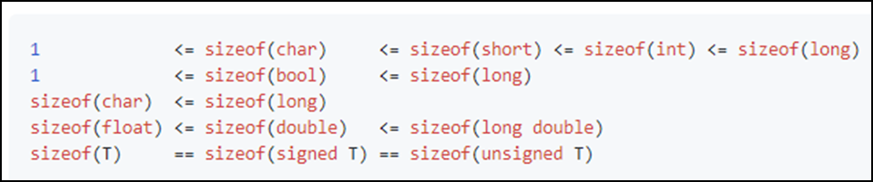

*6) Что делает оператор _sizeof()_?*

Оператор _sizeof_ — это унарный оператор, который вычисляет
и возвращает размер определенной переменной или определенного типа данных в байтах.

*7) Что характеризует тип _std::size_t_?*

Тип _size_t_ характеризует результат,
возвращаемый оператором _sizeof_. Размер типа выбирается таким образом, чтобы в него
можно было записать максимальный размер теоретически возможного массива любого типа.

*8) Назовите фиксированные типы целых в библиотеке _std_.*

Чтобы решить вопрос кроссплатформенности, в язык С++
добавили набор целочисленных типов фиксированного размера,
которые гарантированно имеют один и тот же размер на любой архитектуре:

.Фиксированные типы целых
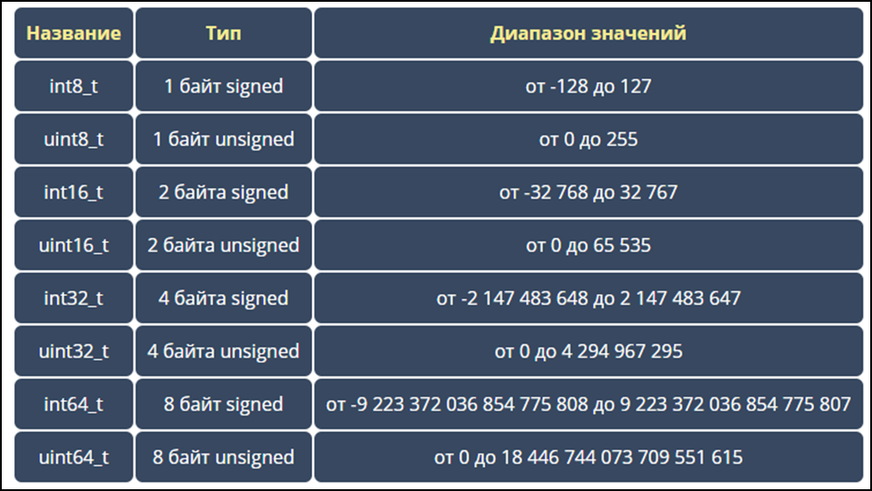

*9) Что такое псевдоним типа?*

Средство языка программирования _C++_,
введённое в синтаксис для повышения
удобства обращения к пользовательским
и встроенным типам данных.

*10) Что такое явное и неявное преобразование типа?*

Преобразование значения
переменной одного типа в значение
другого типа называется приведение типа
и бывает явным и неявным.
При явном приведении перед выражением следует
указать в круглых скобках имя типа, к которому
необходимо преобразовать исходное значение.
При неявном приведении преобразование происходит
автоматически, по правилам, заложенным в языке Си.

.Примеры
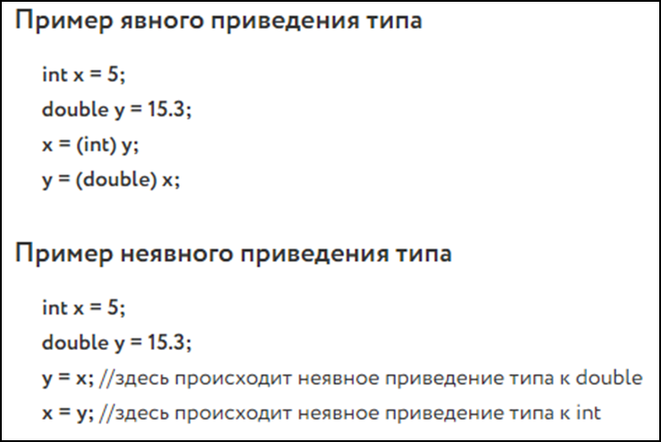

*11) Какие явные преобразования типов вы знаете?*

В языке C++ есть 5 видов операций явного преобразования типов:

- конвертация _C-style_;
- применение оператора _static_cast_;
- применение оператора _const_cast_;
- применение оператора _dynamic_cast_;
- применение оператора _reinterpret_cast_.

Использовали мы два типа явного преобразования: _reinterpret_cast_ и _static_cast_.

*12) Что делает reinterpret_cast?*

Позволяет преобразовывать любой указатель в указатель любого другого типа.
Также позволяет преобразовывать любой целочисленный тип в любой тип указателя и наоборот.

**13) Чем _static_cast_ отличается от _reinterpret_cast_? **

_static_cast_ - это приведение от одного типа к другому,
которое (интуитивно) является приведением, которое при определенных
обстоятельствах может быть успешным и иметь смысл в отсутствие опасного приведения.

A _reinterpret_cast_ - это приведение, которое представляет собой небезопасное преобразование,
которое может переинтерпретировать биты одного значения как биты другого значения.

*14) Что такое ОЗУ и ПЗУ?*

*ОЗУ* - оперативное запоминающее устройство;

*ПЗУ* - постоянное запоминающее устройство.

*ОЗУ* является энергозависимой памятью,
которая временно хранит файлы, с которыми работаем.

*ПЗУ* является энергонезависимой памятью,
которая постоянно хранит служебные команды компьютера.

*15) Каков размер памяти ARM Cortex микроконтроллеров.*

Ядро _ARM_ имеет 4 Гбайт последовательной памяти с адресов _0x00000000_ до _0xFFFFFFFF_.

*16) По какой архитектуре разработан ARM Cortex микроконтроллер?*

Микроконтроллер на ядре _Cortex M4_ выполнен по _модифицированной Гарвардской архитектуре_,
которая представляет по строению общую шину данных и шину адреса для
всех внешних данных, внутри
процессора использовуется шина данных, шина команд и две шины адреса.

*17) В чем отличие Гарвардской архитектуры от Архитектура ФонНеймана?*

Их основное отличие заключалось в том,
что архитектура *Фон Неймана* использует общую шину данных и команд, а *Гарвардская*
предполагает наличие нескольких шин
(в оригинале две: шина данных и шина команд).

*18) Где располагаются локальные переменные?*

Локальные переменные располагаются в регистрах или в стеке.

*19) Где располагаются статические переменные?*

Когда программа загружается в память, ее организуют в разные сегменты.
Один из сегментов - сегмент _DATA._ Сегмент данных далее подразделяется на две части:

*Инициализированный сегмент данных:* Здесь хранятся все глобальные,
статические и постоянные данные.

*Неинициализированный сегмент данных (BSS):* глобальные переменные,
которые не были явно проинициализированы,
попадают в этот сегмент и при загрузке программы инициализируется в нем нулём.

*20) Где располагаются глобальные переменные?*

Инициализированные *глобальные* переменные хранятся в разделе данных.

Неинициализированные *глобальные*,
которые не были явно проинициализированы,
попадают в этот сегмент и при загрузке программы инициализируется в нем нулём.

*21) Что такое стек?*

*Стек* - абстрактный тип данных, представляющий
собой список элементов, организованных
по принципу _LIFO_ (англ. _last in — first out_, «последним пришёл — первым вышел»).

*22) Что такое указатель?*

Указатель это переменная, которая хранит адрес другой переменной.

*23) Что такое разыменовывание указателя?*

*Разыменовывание указателя* - это операция, необходимая для получения значения,
записанного в некоторой области памяти, на которое ссылается указатель.

*24) Что означает взятие адреса?*

Оператор & - это унарный оператор,
возвращающий адрес операнда в памяти.

Например:

_m = &count;_

помещает в m адрес переменной count.
Это адрес внутреннего местоположения переменной в компьютере.
С самим значением переменной ничего не делается. Оператор
& можно запомнить как «_взятие адреса_».
Поэтому вышеупомянутый оператор присваивания можно прочитать
как «_m получает адрес count_».

*25) Какие операции можно выполнять над указателями?*

Указатели можно складывать, вычитать, сравнивать. Но указатели *должны быть одного типа*.

*26) Что такое константный указатель?*

*Константный указатель* — это указатель,
значение которого не может быть изменено после инициализации.
Для объявления константного указателя используется ключевое слово
_const_ между звёздочкой и именем указателя.

*27) Что такое указатель на константу?*

*Указатель на константное значение* — это неконстантный
указатель, который указывает на неизменное значение. Для объявления указателя
на константное значение, используется ключевое слово _const_ перед типом данных.

*28) Что такое ссылка? В чем её отличие от указателя?*

_Ссылка_ не является _указателем_, а просто является другим
именем для объекта. Главное отличие _ссылки_ от _указателей_:
_указатель_ это целое число, для ссылки доступны только 2 операции:
копирование и разыменование. В языках программирования
_ссылка_ может быть реализована как переменная, содержащая адрес ячейки памяти.

*29) Что такое регистр?*

*Регистр* — устройство для записи, хранения и считывания
n-разрядных двоичных данных и выполнения других операций над ними.

*30)Что такое регистры общего назначения?*

*Регистры общего назначения* - это
сверхбыстрая память внутри процессора,
предназначенная для хранения адресов и промежуточных
результатов вычислений (регистр общего назначения/регистр данных)
или данных, необходимых для работы самого процессора.

Регистры общего назначения расположены внутри ядра микроконтроллера(сверхбыстрая память).

*31) Что такое регистры специального назначения?*

*Регистры специального назначения* расположены в ОЗУ микроконтроллера и используются для управления процессором и периферийными устройствами.

Каждый регистр в архитектуре _ARM_ представляет собой ресурс памяти
и имеет длину в _32_ бита, где каждый бит можно представить в виде выключателя
с помощью которого осуществляется управление тем или иным параметром микроконтроллера.

*32) Как можно установить бит в регистре специального назначения?*

Регистры специального назначения используются для управления микроконтроллером и его периферией.

Регистр специального назначения является ячейкой памяти, а установить бит в ней
можно через операцию *|=*

_*reinterpret_cast<uint32_t*>(REGISTER_ADDR) |= (1 << BIT_NUM) ;_

*33) Объясните как вызывается функция.*

При вызове функции происходит примерно следующее:

- в стек помещается фрейм, содержащий:

1. обратный адрес (адрес инструкции, следующей за вызовом функции);

2. Аргументы функции, передаваемые через стек;

3. Память под локальные переменные;

4. Сохраненные копии всех регистров, модифицированных функцией, которые необходимо будет восстановить после того, как функция завершит свое выполнение.

- в оперативные регистры записываются аргументы функции, передаваемые через них;

- процессор переходит к точке начала выполнения функции.

*34) Что такое трансляция?*

*Трансляция* - это преобразование программы, представленной на одном из языков
программирования, в программу на другом языке,
в определенном смысле равносильную первой.

*35) Что такое компоновка?*

*Компоновка* - это один из этапов создания исполняемого файла.
*Компилировать* – проводить трансляцию машинной программы с проблемно-ориентированного языка на
машинно-ориентированный язык (создание объектного кода) для ее исполнения.

*36) Как лучше организовывать структуру проекта и почему?*

При создании структуры проекта стоит соблюдать иерархическую структуру файлов.
Это позволяет облегчить поиск требуемых компонентов.
Все существующие подгруппы разбивают файлы на логические группы.

.Правильные структуры проекта
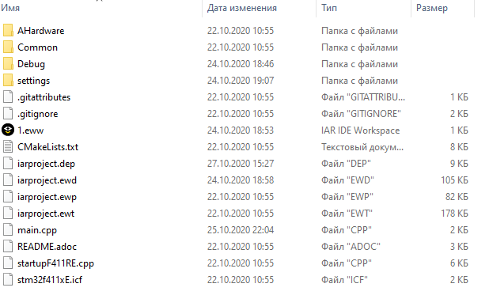
.Правильные структуры проекта
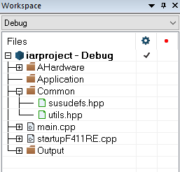

*37) Что такое операторы?*

*Оператор* — это элемент языка, задающий полное описание действия,
которое необходимо выполнить. Каждый оператор представляет собой
законченную фразу языка программирования и определяет некоторый вполне
законченный этап обработки данных. В состав операторов могут входить
служебные слова, данные, выражения и другие операторы. В английском языке
данное
понятие обозначается словом _“statement”_, означающим также _“предложение”_.

*38) Какие арифметические операторы вы знаете?*

_Арифметические операторы_ предоставляют базовые арифметические
действия над типами, такие как сложение,
вычитание, деление, умножение, остаток от деления, присваивание.

.Арифметические операторы
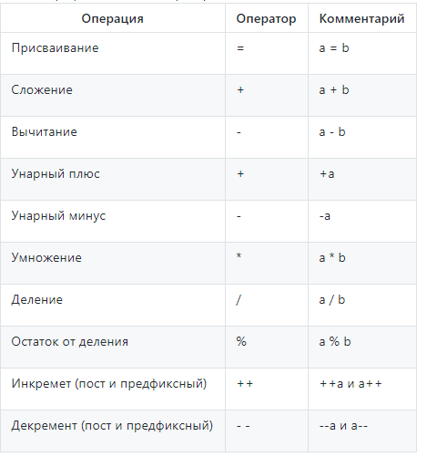

*39) Какие логические операторы вы знаете?*

Логические операторы предоставляют действия над булевым типов.
Результат действия этих операторов может быть только _true_ или _false_.

.Логические операторы
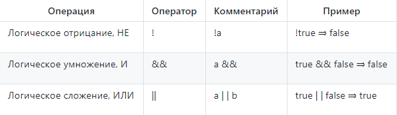

*40) Какие побитовые операторы вы знаете?*

_Побитовые операторы_ предоставляют действия с битами.

.Побитовые операторы
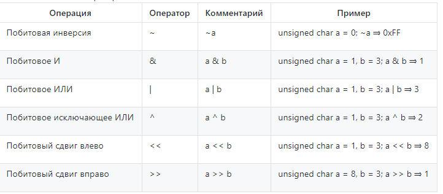

*41) Приведите пример переопределения оператора*

Одна из целей ООП – создание необходимых
пользователю форм представления (типов данных) в виде классов.
Естественное желание, сделать их неотличимыми до такой степени,
чтобы с ними можно было работать как с обычными переменными базовых типов.
Переопределение операций обеспечивает перепрограммирование операций таким образом,
что в качестве
операндов в них могут использоваться объекты интересующего нас типа.

_Пример переопределения опреатора:_

// переопределение операций

    poly operator+(poly T) // Переопределение сложения - конвейер значений
        {
        T.add(*this);      // Второй операнд по значению (копия)
        return T;          // Добавление первого к копии второго
        }

*42) Какие еще операторы вы знаете?*

_+, -, *, /, %, ^, &, |, ~, !, ,, =, <, >, <=, >=, ++, –-, <<, >>,
 ==, !=, &&, ||, +=, -=, /=,
%=, ^=, &=, |=, *=, <<=, >>=, [], (), ->, -> *,

_new, new[],
delete, delete[]._

*43) Как сбросить бит с помощью битовых операторов?*

_x &= ~(1 << номер бита)_

*44) Как установить бит с помощью битовых операторов?*

_x |= (1 << номер бита)_

*45) Как поменять значение бита с помощью битовых операторов?*

_x ^= (1 << номер бита)_

*46) Какой микроконтроллер на отладочной плате XNUCLE ST32F411?*

На отладочной плате _XNUCLE ST32F411_ находится микроконтроллер _ST32F411RE_.

*47) Какие блоки входят в состав микроконтроллера STM32F411?*

Функциональные блоки микроконтроллера _STM32F411_ представлены ниже:

.Функциональные блоки микроконтроллера STM32F411
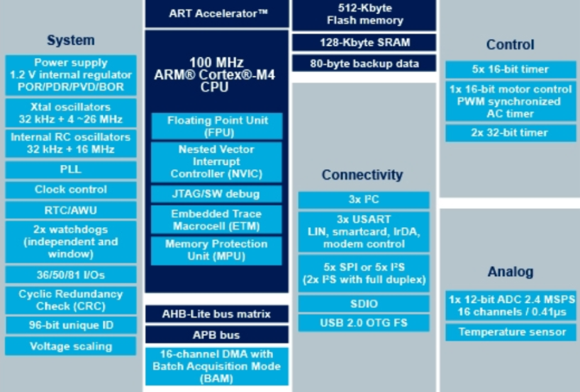

*48)В чем отличие ядра CortexM4 от CortexM3?*

Наличие _DSP_-инструкций, которые
существенно ускоряют обработку потоковых данных.

Возможности _DSP_, входящего в состав M4, позволяют
параллельно выполнять четыре операции сложения/вычитания
для 8-ми разрядных чисел или две операции сложения/вычитания
с 16-ти разрядными операндами. Также реализовано умножение за один цикл,
при этом для 16-ти разрядных чисел возможно параллельное исполнение двух операций.

В серии CortexM4F еще есть блок для работы с плавающей точкой. Чего нет в CortexM3

*49) Назовите основные характеристики микроконтроллера STM32F411.*

Основные характеристики микроконтроллера STM32F411 представлены ниже:

.Основные характеристики
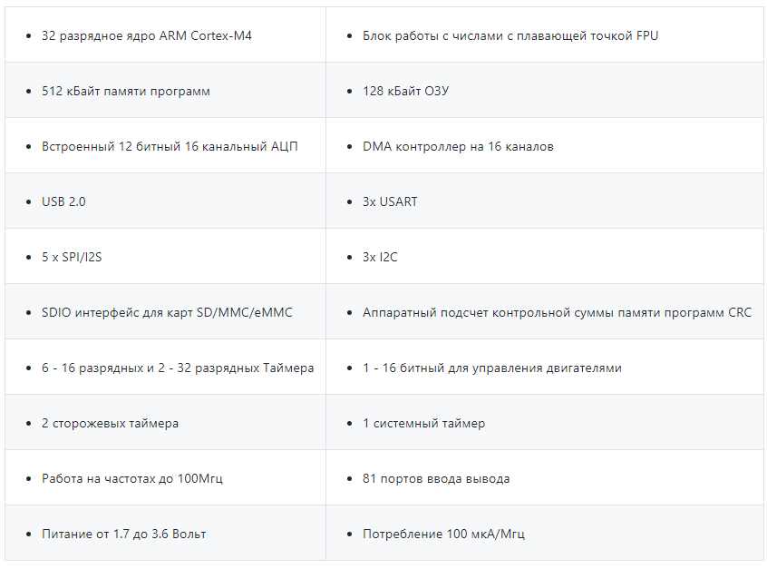

*50) Назовите дополнительные характеристики микроконтроллера STM32F411.*

- Настраиваемые источники тактовой частоты;

- Настраиваемые на различные функции порты;

- Внутренний температурный сенсор;

- Таймеры с настраиваемым модулем ШИМ;

- DMA для работы с модулями (SPI, UART, ADC… );

- 12 разрядный ADC последовательного приближения;

- Часы реального времени;

- Системный таймер и спец. прерывания для облегчения и ускорения работы ОСРВ.

*51) Какие источники тактирования есть у микроконтроллера STM32F411*

Для формирования системной тактовой частоты SYSCLK могут использоваться 4 основных источника:​

- HSI (high-speed internal) — внутренний высокочастотный RC-генератор.​

- HSE (high-speed external) — внешний высокочастотный генератор.​

- PLL — система ФАПЧ. Представляет собой набор из умножителей и делителей, исходный
сигнал он получает от HSI или HSE, а на выходе формирует другую частоту.

- LSI (low-speed internal) — внутренний низкочастотный генератор.

- LSE (low-speed external) — внешний низкочастотный генератор.

*52) Назовите алгоритм подключения системной частоты к источнику тактирования микроконтроллера STM32F411.*

1. Определить какие источники частоты нужны​. Например, _PLL_ нужен для USB​

2. Включить нужный источник​. Используя _Clock Control register (RCC::CR)​_

3. Дождаться стабилизации источника. Используя соответствующие биты _(..RDY) Clock Control register ​(RCC::CR)_

4. Назначить нужный источник на системную частоту​. Используя __Clock Configuration Register (RCC::CFGR)​
__
5. Дождаться пока источник не переключиться на системную частоту​. Используя __Clock Configuration Register (RCC::CFGR)​__

*53) Что такое ФАПЧ?*

_ФАПЧ_ - система автоматического регулирования, подстраивающая фазу
управляемого генератора так, чтобы она
была равна фазе опорного сигнала, либо отличалась на известную функцию от времени.

*54) Что делает следующий код?*

    int main()
    {
        int StudentUdacha = 10;
        int PrepodUdachca = 0 ;
        StudentUdacha =  StudentUdacha ^ PrepodUdachca ;
        PrepodUdachca =  StudentUdacha ^ PrepodUdachca ;
        StudentUdacha ^= PrepodUdachca ;
    }

Сначала присваиваем переменной _StudentUdacha_ значение _10_ (1010).

Затем присваиваем переменной _PrepodUdachca_ значение _0_ (0).

С помощью операции исключающего ИЛИ запишем в переменную _StudentUdacha_
значение 10 (1010)

Далее, в переменную _PrepodUdachca_ с помощью операции исключающего ИЛИ запишем
значение 10 (1010)

В конце, используем инверсию и получаем, что в переменную _StudentUdacha_ записалось
значение 0.

С помощью данного кода можно поменять
местами значения переменных без использования буферной переменной.
